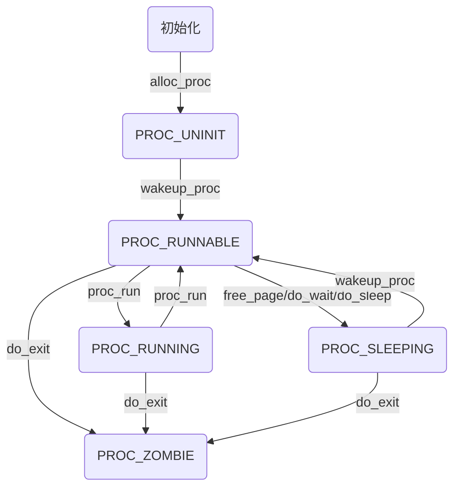

## OS_LAB5

**注意当父进程要终止而子进程尚未结束时，将子进程的父指针指向init_proc。当子进程状态为PROC_ZOMBIE时等待init_proc统一进行回收**

### 加载应用程序并执行

load_icode 函数主要用来被 do_execve 调用，将执行程序加载到进程空间（执行程序本身已从磁盘读取到内存中），给用户进程建立一个能够让用户进程正常运行的用户环境。这涉及到修改页表、分配用户栈等工作。

该函数主要完成的工作如下：

- 1、调用 mm_create 函数来申请进程的内存管理数据结构 mm 所需内存空间,并对 mm 进行初始化;
- 2、调用 setup_pgdir 来申请一个页目录表所需的一个页大小的内存空间，并把描述 ucore 内核虚空间映射的内核页表( boot_pgdir 所指)的内容拷贝到此新目录表中，最后让 mm->pgdir 指向此页目录表，这就是进程新的页目录表了，且能够正确映射内核虚空间;
- 3、根据可执行程序的起始位置来解析此 ELF 格式的执行程序，并调用 mm_map 函数根据 ELF 格式执行程序的各个段(代码段、数据段、BSS 段等)的起始位置和大小建立对应的 vma 结构，并把 vma 插入到 mm 结构中，表明这些是用户进程的合法用户态虚拟地址空间;
- 4、根据可执行程序各个段的大小分配物理内存空间，并根据执行程序各个段的起始位置确定虚拟地址，并在页表中建立好物理地址和虚拟地址的映射关系，然后把执行程序各个段的内容拷贝到相应的内核虚拟地址中，至此应用程序执行码和数据已经根据编译时设定地址放置到虚拟内存中了;
- 5、需要给用户进程设置用户栈，为此调用 mm_mmap 函数建立用户栈的 vma 结构,明确用户栈的位置在用户虚空间的顶端，大小为 256 个页，即 1MB，并分配一定数量的物理内存且建立好栈的虚地址<-->物理地址映射关系;
- 6、至此，进程内的内存管理 vma 和 mm 数据结构已经建立完成，于是把 mm->pgdir 赋值到 cr3 寄存器中，即更新了用户进程的虚拟内存空间，此时的 init 已经被 exit 的代码和数据覆盖，成为了第一个用户进程，但此时这个用户进程的执行现场还没建立好;
- 7、先清空进程的中断帧,再重新设置进程的中断帧，使得在执行中断返回指令 iret 后，能够让 CPU 转到用户态特权级，并回到用户态内存空间，使用用户态的代码段、数据段和堆栈，且能够跳转到用户进程的第一条指令执行，并确保在用户态能够响应中断;

简单的说，该 load_icode 函数的主要工作就是给用户进程建立一个能够让用户进程正常运行的用户环境。


```c
// do_execve - call exit_mmap(mm)&put_pgdir(mm) to reclaim memory space of current process
//           - call load_icode to setup new memory space accroding binary prog.
// do_execve 函数主要做的工作就是先回收自身所占用户空间，然后调用 load_icode，用新的程序覆盖内存空间，形成一个执行新程序的新进程。 
int
do_execve(const char *name, size_t len, unsigned char *binary, size_t size) {
    struct mm_struct *mm = current->mm; //获取当前进程的内存地址
    if (!user_mem_check(mm, (uintptr_t)name, len, 0)) {
        return -E_INVAL;
    }
    if (len > PROC_NAME_LEN) {
        len = PROC_NAME_LEN;
    }

    char local_name[PROC_NAME_LEN + 1];
    memset(local_name, 0, sizeof(local_name));
    memcpy(local_name, name, len);
    //为加载新的执行码做好用户态内存空间清空准备 
    if (mm != NULL) {
        lcr3(boot_cr3); //设置页表为内核空间页表
        if (mm_count_dec(mm) == 0) { //如果没有进程再需要此进程所占用的内存空间
            exit_mmap(mm); //释放进程所占用户空间内存和进程页表本身所占空间
            put_pgdir(mm);
            mm_destroy(mm);
        }
        current->mm = NULL; //把当前进程的 mm 内存管理指针为空
    }
    int ret;
    // 加载应用程序执行码到当前进程的新创建的用户态虚拟空间中。这里涉及到读 ELF 格式的文件，申请内存空间，建立用户态虚存空间，加载应用程序执行码等。load_icode 函数完成了整个复杂的工作。  
    if ((ret = load_icode(binary, size)) != 0) {
        goto execve_exit;
    }
    set_proc_name(current, local_name);
    return 0;

execve_exit:
    do_exit(ret);
    panic("already exit: %e.\n", ret);
}

//执行中断返回指令 iret 后，将切换到用户进程程序的第一条语句位置 _start 处开始执行。
```


```c
load_icode 函数分析:
该函数的功能主要分为 6 个部分，而我们需要填写的是第 6 个部分，就是伪造中断返回现场，使得系统调用返回之后可以正确跳转到需要运行的程序入口，并正常运行；而 1-5 部分则是一系列对用户内存空间的初始化，这部分将在 LAB8 的编码实现中具体体现，因此在本 LAB 中暂时不加具体说明；与 LAB1 的 challenge 类似的，第 6 个部分是在进行中断处理的栈（此时应当是内核栈）上伪造一个中断返回现场，使得中断返回的时候可以正确地切换到需要的执行程序入口处；在这个部分中需要对 tf 进行设置，不妨通过代码分析来确定这个 tf 变量究竟指到什么位置，该 tf 变量与 current->tf 的数值一致，而 current->tf 是在进行中断服务例程的 trap 函数中被设置为当前中断的中断帧，也就是说这个 tf 最终指向了当前系统调用 exec 产生的中断帧处；
/* load_icode - load the content of binary program(ELF format) as the new content of current process
 * @binary:  the memory addr of the content of binary program
 * @size:  the size of the content of binary program
 */
static int load_icode(unsigned char *binary, size_t size) {
    if (current->mm != NULL) { //当前进程的内存为空
        panic("load_icode: current->mm must be empty.\n");
    }

    int ret = -E_NO_MEM; //记录错误信息：未分配内存
    struct mm_struct *mm;
    //(1) create a new mm for current process
    if ((mm = mm_create()) == NULL) { //分配内存
        goto bad_mm; //分配失败，返回
    }
    //(2) create a new PDT, and mm->pgdir= kernel virtual addr of PDT
    if (setup_pgdir(mm) != 0) { //申请一个页目录表所需的空间
        goto bad_pgdir_cleanup_mm; //申请失败
    }
    //(3) copy TEXT/DATA section, build BSS parts in binary to memory space of process
    struct Page *page;
    //(3.1) get the file header of the bianry program (ELF format)
    struct elfhdr *elf = (struct elfhdr *)binary;
    //(3.2) get the entry of the program section headers of the bianry program (ELF format)
    struct proghdr *ph = (struct proghdr *)(binary + elf->e_phoff); //获取段头部表的地址
    //(3.3) This program is valid?
    if (elf->e_magic != ELF_MAGIC) { //读取的 ELF 文件不合法
        ret = -E_INVAL_ELF; //ELF 文件不合法错误
        goto bad_elf_cleanup_pgdir; //返回
    }

    uint32_t vm_flags, perm;
    struct proghdr *ph_end = ph + elf->e_phnum; //段入口数目
    for (; ph < ph_end; ph ++) { //遍历每一个程序段
    //(3.4) find every program section headers
        if (ph->p_type != ELF_PT_LOAD) { //当前段不能被加载
            continue ;
        }
        if (ph->p_filesz > ph->p_memsz) { //虚拟地址空间大小大于分配的物理地址空间
            ret = -E_INVAL_ELF;
            goto bad_cleanup_mmap;
        }
        if (ph->p_filesz == 0) { //当前段大小为 0
            continue ;
        }
    //(3.5) call mm_map fun to setup the new vma ( ph->p_va, ph->p_memsz)
        vm_flags = 0, perm = PTE_U;
        if (ph->p_flags & ELF_PF_X) vm_flags |= VM_EXEC;
        if (ph->p_flags & ELF_PF_W) vm_flags |= VM_WRITE;
        if (ph->p_flags & ELF_PF_R) vm_flags |= VM_READ;
        if (vm_flags & VM_WRITE) perm |= PTE_W;
        if ((ret = mm_map(mm, ph->p_va, ph->p_memsz, vm_flags, NULL)) != 0) {
            goto bad_cleanup_mmap;
        }
        unsigned char *from = binary + ph->p_offset;
        size_t off, size;
        uintptr_t start = ph->p_va, end, la = ROUNDDOWN(start, PGSIZE);

        ret = -E_NO_MEM;

     //(3.6) alloc memory, and  copy the contents of every program section (from, from+end) to process's memory (la, la+end)
        end = ph->p_va + ph->p_filesz;
     //(3.6.1) copy TEXT/DATA section of bianry program
        while (start < end) {
            if ((page = pgdir_alloc_page(mm->pgdir, la, perm)) == NULL) {
                goto bad_cleanup_mmap;
            }
            off = start - la, size = PGSIZE - off, la += PGSIZE;
            if (end < la) {
                size -= la - end;
            }
            memcpy(page2kva(page) + off, from, size);
            start += size, from += size;
        }

      //(3.6.2) build BSS section of binary program
        end = ph->p_va + ph->p_memsz;
        if (start < la) {
            /* ph->p_memsz == ph->p_filesz */
            if (start == end) {
                continue ;
            }
            off = start + PGSIZE - la, size = PGSIZE - off;
            if (end < la) {
                size -= la - end;
            }
            memset(page2kva(page) + off, 0, size);
            start += size;
            assert((end < la && start == end) || (end >= la && start == la));
        }
        while (start < end) {
            if ((page = pgdir_alloc_page(mm->pgdir, la, perm)) == NULL) {
                goto bad_cleanup_mmap;
            }
            off = start - la, size = PGSIZE - off, la += PGSIZE;
            if (end < la) {
                size -= la - end;
            }
            memset(page2kva(page) + off, 0, size);
            start += size;
        }
    }
    //(4) build user stack memory
    vm_flags = VM_READ | VM_WRITE | VM_STACK;
    if ((ret = mm_map(mm, USTACKTOP - USTACKSIZE, USTACKSIZE, vm_flags, NULL)) != 0) {
        goto bad_cleanup_mmap;
    }
    assert(pgdir_alloc_page(mm->pgdir, USTACKTOP-PGSIZE , PTE_USER) != NULL);
    assert(pgdir_alloc_page(mm->pgdir, USTACKTOP-2*PGSIZE , PTE_USER) != NULL);
    assert(pgdir_alloc_page(mm->pgdir, USTACKTOP-3*PGSIZE , PTE_USER) != NULL);
    assert(pgdir_alloc_page(mm->pgdir, USTACKTOP-4*PGSIZE , PTE_USER) != NULL);
    
    //(5) set current process's mm, sr3, and set CR3 reg = physical addr of Page Directory
    mm_count_inc(mm);
    current->mm = mm;
    current->cr3 = PADDR(mm->pgdir);
    lcr3(PADDR(mm->pgdir));

    //(6) setup trapframe for user environment
    struct trapframe *tf = current->tf;
    memset(tf, 0, sizeof(struct trapframe));
    /* LAB5:EXERCISE1 YOUR CODE
     * should set tf_cs,tf_ds,tf_es,tf_ss,tf_esp,tf_eip,tf_eflags
     * NOTICE: If we set trapframe correctly, then the user level process can return to USER MODE from kernel. So
     *          tf_cs should be USER_CS segment (see memlayout.h)
     *          tf_ds=tf_es=tf_ss should be USER_DS segment
     *          tf_esp should be the top addr of user stack (USTACKTOP)
     *          tf_eip should be the entry point of this binary program (elf->e_entry)
     *          tf_eflags should be set to enable computer to produce Interrupt
     */
--------------------------------------------------------------------------------------------
进程切换总是在内核态中发生，当内核选择一个进程执行的时候，首先切换内核态的上下文（EBX、ECX、EDX、ESI、EDI、ESP、EBP、EIP 八个寄存器）以及内核栈。完成内核态切换之后，内核需要使用 IRET 指令将 trapframe 中的用户态上下文恢复出来，返回到进程态，在用户态中执行进程。
* 实现思路：
  1. 由于最终是在用户态下运行的，所以需要将段寄存器初始化为用户态的代码段、数据段、堆栈段；
  2. esp 应当指向先前的步骤中创建的用户栈的栈顶；
  3. eip 应当指向 ELF 可执行文件加载到内存之后的入口处；
  4. eflags 中应当初始化为中断使能，注意 eflags 的第 1 位是恒为 1 的；
  5. 设置 ret 为 0，表示正常返回；

load_icode 函数需要填写的部分为：
  * 将 trapframe 的代码段设为 USER_CS；
  * 将 trapframe 的数据段、附加段、堆栈段设为 USER_DS；
  * 将 trapframe 的栈顶指针设为 USTACKTOP；
  * 将 trapframe 的代码段指针设为 ELF 的入口地址 elf->e_entry；
  * 将 trapframe 中 EFLAGS 的 IF 置为 1。
--------------------------------------------------------------------------------------------
/*code*/
    tf->tf_cs = USER_CS;
    tf->tf_ds = tf->tf_es = tf->tf_ss = USER_DS;
    tf->tf_esp = USTACKTOP; //0xB0000000
    tf->tf_eip = elf->e_entry;
    tf->tf_eflags = FL_IF; //FL_IF为中断打开状态
    ret = 0;
--------------------------------------------------------------------------------------------
out:
    return ret;
bad_cleanup_mmap:
    exit_mmap(mm);
bad_elf_cleanup_pgdir:
    put_pgdir(mm);
bad_pgdir_cleanup_mm:
    mm_destroy(mm);
bad_mm:
    goto out;
}
```

> 请在实验报告中描述当创建一个用户态进程并加载了应用程序后，CPU 是如何让这个应用程序最终在用户态执行起来的。即这个用户态进程被 ucore 选择占用 CPU 执行（RUNNING 态）到具体执行应用程序第一条指令的整个经过。

分析在创建了用户态进程并且加载了应用程序之后，其占用 CPU 执行到具体执行应用程序的整个经过：

1. 在经过调度器占用了 CPU 的资源之后，用户态进程调用了 exec 系统调用，从而转入到了系统调用的处理例程；
2. 在经过了正常的中断处理例程之后，最终控制权转移到了 syscall.c 中的 syscall 函数，然后根据系统调用号转移给了 sys_exec 函数，在该函数中调用了上文中提及的 do_execve 函数来完成指定应用程序的加载；
3. 在do_execve中进行了若干设置，包括推出当前进程的页表，换用 kernel 的 PDT 之后，使用 load_icode 函数，完成了对整个用户线程内存空间的初始化，包括堆栈的设置以及将 ELF 可执行文件的加载，之后通过 current->tf 指针修改了当前系统调用的 trapframe，使得最终中断返回的时候能够切换到用户态，并且同时可以正确地将控制权转移到应用程序的入口处；
4. 在完成了 do_exec 函数之后，进行正常的中断返回的流程，由于中断处理例程的栈上面的 eip 已经被修改成了应用程序的入口处，而 CS 上的 CPL 是用户态，因此 iret 进行中断返回的时候会将堆栈切换到用户的栈，并且完成特权级的切换，并且跳转到要求的应用程序的入口处；
5. 接下来开始具体执行应用程序的第一条指令；


### 父进程复制自己的内存空间给子进程

```c

/* do_fork -     parent process for a new child process
 * @clone_flags: used to guide how to clone the child process
 * @stack:       the parent's user stack pointer. if stack==0, It means to fork a kernel thread.
 * @tf:          the trapframe info, which will be copied to child process's proc->tf
 */
int
do_fork(uint32_t clone_flags, uintptr_t stack, struct trapframe *tf) {
    int ret = -E_NO_FREE_PROC;
    struct proc_struct *proc;
    if (nr_process >= MAX_PROCESS) {
        goto fork_out;
    }
    ret = -E_NO_MEM;
    //LAB4:EXERCISE2 YOUR CODE
    /*
     * Some Useful MACROs, Functions and DEFINEs, you can use them in below implementation.
     * MACROs or Functions:
     *   alloc_proc:   create a proc struct and init fields (lab4:exercise1)
     *   setup_kstack: alloc pages with size KSTACKPAGE as process kernel stack
     *   copy_mm:      process "proc" duplicate OR share process "current"'s mm according clone_flags
     *                 if clone_flags & CLONE_VM, then "share" ; else "duplicate"
     *   copy_thread:  setup the trapframe on the  process's kernel stack top and
     *                 setup the kernel entry point and stack of process
     *   hash_proc:    add proc into proc hash_list
     *   get_pid:      alloc a unique pid for process
     *   wakeup_proc:  set proc->state = PROC_RUNNABLE
     * VARIABLES:
     *   proc_list:    the process set's list
     *   nr_process:   the number of process set
     */

     //    1. call alloc_proc to allocate a proc_struct
    //    2. call setup_kstack to allocate a kernel stack for child process
    //    3. call copy_mm to dup OR share mm according clone_flag
    //    4. call copy_thread to setup tf & context in proc_struct
    //    5. insert proc_struct into hash_list && proc_list
    //    6. call wakeup_proc to make the new child process RUNNABLE
    //    7. set ret vaule using child proc's pid

    //LAB5 YOUR CODE : (update LAB4 steps)
    /* Some Functions
     *    set_links:  set the relation links of process.  ALSO SEE: remove_links:  lean the relation links of process
     *    -------------------
     *    update step 1: set child proc's parent to current process, make sure current process's wait_state is 0
     *    update step 5: insert proc_struct into hash_list && proc_list, set the relation links of process
     */

    if((proc = alloc_proc()) == NULL) goto fork_out;
  	// step 1 update
    proc->parent = current;

    if(setup_kstack(proc) != 0) goto bad_fork_cleanup_proc;
    if(copy_mm(clone_flags, proc) != 0) goto bad_fork_cleanup_kstack;
    copy_thread(proc, stack, tf);
    bool intr_flag;
    local_intr_save(intr_flag);
    {
        proc->pid = get_pid();
        hash_proc(proc);
      	// step 5 update
        // old : list_add(&proc_list, &(proc->list_link));
        // new : set_links(proc);
        set_links(proc);
        ++nr_process;
    }
    local_intr_restore(intr_flag);
    wakeup_proc(proc);

   ret = proc->pid;
fork_out:
    return ret;

bad_fork_cleanup_kstack:
    put_kstack(proc);
bad_fork_cleanup_proc:
    kfree(proc);
    goto fork_out;
}
```

> 请在实验报告中简要说明如何设计实现 ”Copy on Write 机制“，给出概要设计，鼓励给出详细设计。

接下来将说明如何实现 “Copy on Write” 机制，该机制的主要思想为使得进程执行 fork 系统调用进行复制的时候，父进程不会简单地将整个内存中的内容复制给子进程，而是暂时共享相同的物理内存页；而当其中一个进程需要对内存进行修改的时候，再额外创建一个自己私有的物理内存页，将共享的内容复制过去，然后在自己的内存页中进行修改；根据上述分析，主要对实验框架的修改应当主要有两个部分，一个部分在于进行 fork 操作的时候不直接复制内存，另外一个处理在于出现了内存页访问异常的时候，会将共享的内存页复制一份，然后在新的内存页进行修改，具体的修改部分如下：

- do fork 部分：在进行内存复制的部分，比如 copy_range 函数内部，不实际进行内存的复制，而是将子进程和父进程的虚拟页映射上同一个物理页面，然后在分别在这两个进程的虚拟页对应的 PTE 部分将这个页置成是不可写的，同时利用 PTE 中的保留位将这个页设置成共享的页面，这样的话如果应用程序试图写某一个共享页就会产生页访问异常，从而可以将控制权交给操作系统进行处理；
- page fault 部分：在 page fault 的 ISR 部分，新增加对当前的异常是否由于尝试写了某一个共享页面引起的，如果是的话，额外申请分配一个物理页面，然后将当前的共享页的内容复制过去，建立出错的线性地址与新创建的物理页面的映射关系，将 PTE 设置设置成非共享的；然后查询原先共享的物理页面是否还是由多个其它进程共享使用的，如果不是的话，就将对应的虚地址的 PTE 进行修改，删掉共享标记，恢复写标记；这样的话 page fault 返回之后就可以正常完成对虚拟内存（原想的共享内存）的写操作了；

#### fork

调用过程为：`fork -> SYS_fork -> do_fork + wakeup_proc`

首先当程序执行 fork 时，fork 使用了系统调用 SYS_fork，而系统调用 SYS_fork 则主要是由 do_fork 和 wakeup_proc 来完成的。do_fork() 完成的工作在练习 2 及 lab4 中已经做过详细介绍，这里再简单说一下，主要是完成了以下工作：

- 1、分配并初始化进程控制块（ alloc_proc 函数）;
- 2、分配并初始化内核栈，为内核进程（线程）建立栈空间（ setup_stack 函数）;
- 3、根据 clone_flag 标志复制或共享进程内存管理结构（ copy_mm 函数）;
- 4、设置进程在内核（将来也包括用户态）正常运行和调度所需的中断帧和执行上下文 （ copy_thread 函数）;
- 5、为进程分配一个 PID（ get_pid() 函数）;
- 6、把设置好的进程控制块放入 hash_list 和 proc_list 两个全局进程链表中;
- 7、自此，进程已经准备好执行了，把进程状态设置为“就绪”态;
- 8、设置返回码为子进程的 PID 号。

而 wakeup_proc 函数主要是将进程的状态设置为等待，即 proc->wait_state = 0。


#### exec

调用过程为：`SYS_exec -> do_execve`

当应用程序执行的时候，会调用 SYS_exec 系统调用，而当 ucore 收到此系统调用的时候，则会使用 do_execve() 函数来实现，因此这里我们主要介绍 do_execve() 函数的功能，函数主要时完成用户进程的创建工作，同时使用户进程进入执行。

- 1、首先为加载新的执行码做好用户态内存空间清空准备。如果 mm 不为 NULL，则设置页表为内核空间页表，且进一步判断 mm 的引用计数减 1 后是否为 0，如果为 0，则表明没有进程再需要此进程所占用的内存空间，为此将根据 mm 中的记录，释放进程所占用户空间内存和进程页表本身所占空间。最后把当前进程的 mm 内存管理指针为空。
- 2、接下来是加载应用程序执行码到当前进程的新创建的用户态虚拟空间中。之后就是调用 load_icode 从而使之准备好执行。（具体 load_icode 的功能在练习 1 已经介绍的很详细了，这里不赘述了）


#### wait

调用过程为：`SYS_wait->do_wait`

```c
/*
   file_path:kern/process/proc.c
*/
// do_wait - wait one OR any children with PROC_ZOMBIE state, and free memory space of kernel stack
//         - proc struct of this child.
// NOTE: only after do_wait function, all resources of the child proces are free.
int do_wait(int pid, int *code_store) {
    struct mm_struct *mm = current->mm;
    if (code_store != NULL) {
        if (!user_mem_check(mm, (uintptr_t)code_store, sizeof(int), 1)) {
            return -E_INVAL;
        }
    }
    struct proc_struct *proc;
    bool intr_flag, haskid;
repeat:
    haskid = 0;
    //如果pid！=0，则找到进程id为pid的处于退出状态的子进程 
    if (pid != 0) {
        proc = find_proc(pid);
        if (proc != NULL && proc->parent == current) {
            haskid = 1;
            if (proc->state == PROC_ZOMBIE) {
                goto found; //找到进程
            }
        }
    }
    else {
      //如果pid==0，则随意找一个处于退出状态的子进程
        proc = current->cptr;
        for (; proc != NULL; proc = proc->optr) {
            haskid = 1;
            if (proc->state == PROC_ZOMBIE) {
                goto found;
            }
        }
    }
    if (haskid) {//如果没找到，则父进程重新进入睡眠，并重复寻找的过程
        current->state = PROC_SLEEPING;
        current->wait_state = WT_CHILD;
        schedule();
        if (current->flags & PF_EXITING) {
            do_exit(-E_KILLED);
        }
        goto repeat;
    }
    return -E_BAD_PROC;
   //释放子进程的所有资源 
found:
    if (proc == idleproc || proc == initproc) {
        panic("wait idleproc or initproc.\n");
    }
    if (code_store != NULL) {
        *code_store = proc->exit_code;
    }
    local_intr_save(intr_flag);
    {
        unhash_proc(proc);//将子进程从hash_list中删除
        remove_links(proc);//将子进程从proc_list中删除 
    }
    local_intr_restore(intr_flag);
    put_kstack(proc); //释放子进程的内核堆栈
    kfree(proc);  //释放子进程的进程控制块
    return 0;
}
```

当执行 wait 功能的时候，会调用系统调用 SYS_wait，而该系统调用的功能则主要由 do_wait 函数实现，主要工作就是父进程如何完成对子进程的最后回收工作，具体的功能实现如下：

- 1、 如果 pid!=0，表示只找一个进程 id 号为 pid 的退出状态的子进程，否则找任意一个处于退出状态的子进程;
- 2、 如果此子进程的执行状态不为 PROC_ZOMBIE，表明此子进程还没有退出，则当前进程设置执行状态为 PROC_SLEEPING（睡眠），睡眠原因为 WT_CHILD (即等待子进程退出)，调用 schedule() 函数选择新的进程执行，自己睡眠等待，如果被唤醒，则重复跳回步骤 1 处执行;
- 3、 如果此子进程的执行状态为 PROC_ZOMBIE，表明此子进程处于退出状态，需要当前进程(即子进程的父进程)完成对子进程的最终回收工作，即首先把子进程控制块从两个进程队列 proc_list 和 hash_list 中删除，并释放子进程的内核堆栈和进程控制块。自此，子进程才彻底地结束了它的执行过程，它所占用的所有资源均已释放。


#### exit

调用过程为：`SYS_exit->exit`

```c
/*
   file_path:kern/process/proc.c
*/
// do_exit - called by sys_exit
//   1. call exit_mmap & put_pgdir & mm_destroy to free the almost all memory space of process
//   2. set process' state as PROC_ZOMBIE, then call wakeup_proc(parent) to ask parent reclaim itself.
//   3. call scheduler to switch to other process
int do_exit(int error_code) {
    if (current == idleproc) {
        panic("idleproc exit.\n");
    }
    if (current == initproc) {
        panic("initproc exit.\n");
    }
    struct mm_struct *mm = current->mm;
    if (mm != NULL) { //如果该进程是用户进程
        lcr3(boot_cr3); //切换到内核态的页表
        if (mm_count_dec(mm) == 0){
            exit_mmap(mm); 
/*如果没有其他进程共享这个内存释放current->mm->vma链表中每个vma描述的进程合法空间中实际分配的内存，然后把对应的页表项内容清空，最后还把页表所占用的空间释放并把对应的页目录表项清空*/
            put_pgdir(mm); //释放页目录占用的内存 
            mm_destroy(mm); //释放mm占用的内存
        }
        current->mm = NULL; //虚拟内存空间回收完毕
    }
    current->state = PROC_ZOMBIE; //僵死状态
    current->exit_code = error_code;//等待父进程做最后的回收
    bool intr_flag;
    struct proc_struct *proc;
    local_intr_save(intr_flag);
    {
        proc = current->parent;
        if (proc->wait_state == WT_CHILD) {
            wakeup_proc(proc); //如果父进程在等待子进程，则唤醒
        }
        while (current->cptr != NULL) {
 /*如果当前进程还有子进程，则需要把这些子进程的父进程指针设置为内核线程initproc，且各个子进程指针需要插入到initproc的子进程链表中。如果某个子进程的执行状态是PROC_ZOMBIE，则需要唤醒initproc来完成对此子进程的最后回收工作。*/
            proc = current->cptr;
            current->cptr = proc->optr;

            proc->yptr = NULL;
            if ((proc->optr = initproc->cptr) != NULL) {
                initproc->cptr->yptr = proc;
            }
            proc->parent = initproc;
            initproc->cptr = proc;
            if (proc->state == PROC_ZOMBIE) {
                if (initproc->wait_state == WT_CHILD) {
                    wakeup_proc(initproc);
                }
            }
        }
    }
    local_intr_restore(intr_flag);
    schedule(); //选择新的进程执行
    panic("do_exit will not return!! %d.\n", current->pid);
}
```

当执行 exit 功能的时候，会调用系统调用 SYS_exit，而该系统调用的功能主要是由 do_exit 函数实现。具体过程如下：

- 1、先判断是否是用户进程，如果是，则开始回收此用户进程所占用的用户态虚拟内存空间;（具体的回收过程不作详细说明）
- 2、设置当前进程的状态为 PROC_ZOMBIE，然后设置当前进程的退出码为 error_code。表明此时这个进程已经无法再被调度了，只能等待父进程来完成最后的回收工作（主要是回收该子进程的内核栈、进程控制块）
- 3、如果当前父进程已经处于等待子进程的状态，即父进程的 wait_state 被置为 WT_CHILD，则此时就可以唤醒父进程，让父进程来帮子进程完成最后的资源回收工作。
- 4、如果当前进程还有子进程,则需要把这些子进程的父进程指针设置为内核线程 init，且各个子进程指针需要插入到 init 的子进程链表中。如果某个子进程的执行状态是 PROC_ZOMBIE，则需要唤醒 init 来完成对此子进程的最后回收工作。
- 5、执行 schedule() 调度函数，选择新的进程执行。

所以说该函数的功能简单的说就是，回收当前进程所占的大部分内存资源,并通知父进程完成最后的回收工作。


> 请分析 fork/exec/wait/exit 在实现中是如何影响进程的执行状态的？

- fork 执行完毕后，如果创建新进程成功，则出现两个进程，一个是子进程，一个是父进程。在子进程中，fork 函数返回 0，在父进程中，fork 返回新创建子进程的进程 ID。我们可以通过 fork 返回的值来判断当前进程是子进程还是父进程。fork 不会影响当前进程的执行状态，但是会将子进程的状态标记为 RUNNALB，使得可以在后续的调度中运行起来；
- exec 完成用户进程的创建工作。首先为加载新的执行码做好用户态内存空间清空准备。接下来的一步是加载应用程序执行码到当前进程的新创建的用户态虚拟空间中。exec 不会影响当前进程的执行状态，但是会修改当前进程中执行的程序；
- wait 是等待任意子进程的结束通知。wait_pid 函数等待进程 id 号为 pid 的子进程结束通知。这两个函数最终访问 sys_wait 系统调用接口让 ucore 来完成对子进程的最后回收工作。wait 系统调用取决于是否存在可以释放资源（ZOMBIE）的子进程，如果有的话不会发生状态的改变，如果没有的话会将当前进程置为 SLEEPING 态，等待执行了 exit 的子进程将其唤醒；
- exit 会把一个退出码 error_code 传递给 ucore，ucore 通过执行内核函数 do_exit 来完成对当前进程的退出处理，主要工作简单地说就是回收当前进程所占的大部分内存资源，并通知父进程完成最后的回收工作。exit 会将当前进程的状态修改为 ZOMBIE 态，并且会将父进程唤醒（修改为RUNNABLE），然后主动让出 CPU 使用权；

> 请给出 ucore 中一个用户态进程的执行状态生命周期图（包执行状态，执行状态之间的变换关系，以及产生变换的事件或函数调用）。（字符方式画即可）



